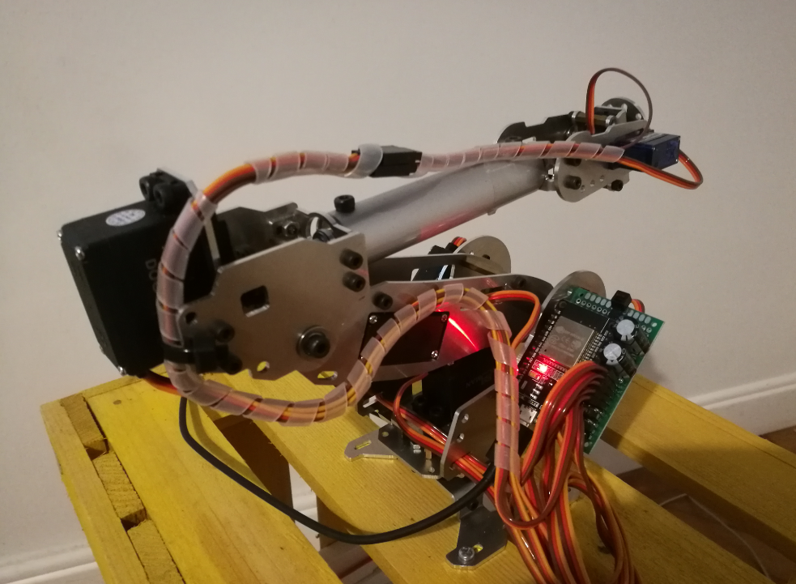

# 6DOF Robot Arm Inverse Kinematic

Solution for controlling 6DOF Robot Arm from Python wirelessly via Bluetooth connection.

**Table of Contents**

- [6DOF Robot Arm Inverse Kinematic](#6dof-robot-arm-inverse-kinematic)
  * [About The Project](#about-the-project)
    + [Built With](#built-with)
  * [Getting Started](#getting-started)
    + [Prerequisites](#prerequisites)
    + [App installation](#app-installation)
  * [Contact](#contact)

## About The Project

The project was developed to control 6DOF robotic arm by inputting joint angles or top position. Inverse kinematic is used to calculate required angles from top position. Communication is realized via Bluetooth with the help of ESP32. Servos are controlled directly from ESP32 pins without additional hardware.

### Built With

* [PlatformIO](https://platformio.org)
* [Visual Studio Code](https://code.visualstudio.com)

## Getting Started

Follow this steps to set up the hardware and software.

### Prerequisites

* Visual Studio Code with PlatformIO plugin

### App installation

1. Upload the `main.cpp` code to the ESP32 board
2. Run `robot_control_.py` and wait until connection with the board is established and UI is displayed

## Contact

Primoz Flander: [primoz.flander@gmail.com](<mailto:primoz.flander@gmail.com>)

Project Link: [6DOF Robot Arm Inverse Kinematic](https://github.com/primozflander/6dof_robot_arm_inverse_kinematic)
